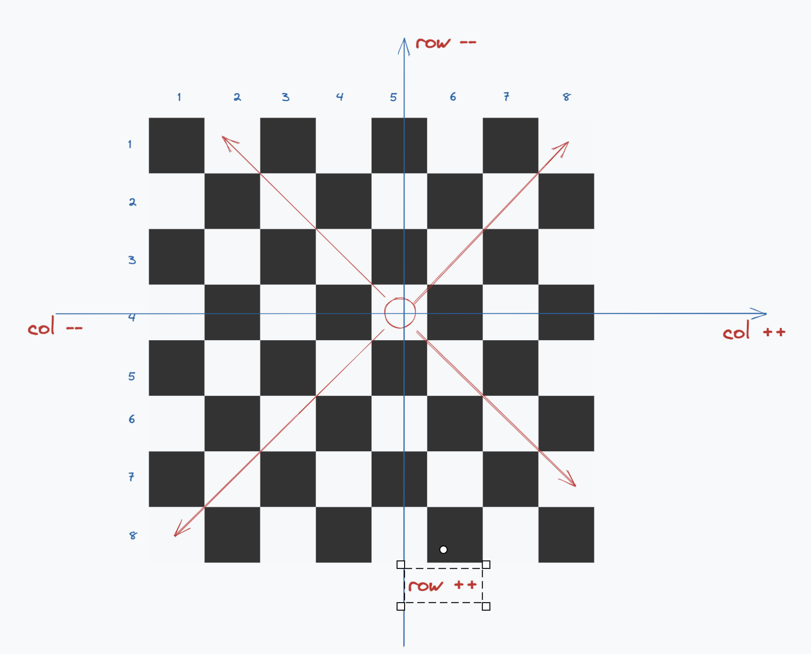
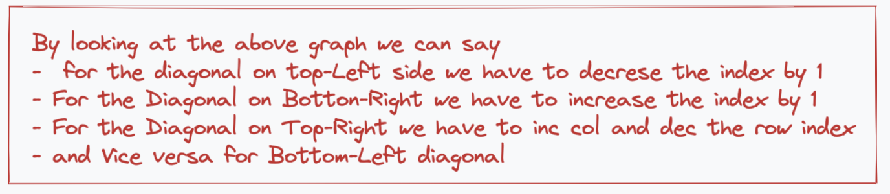
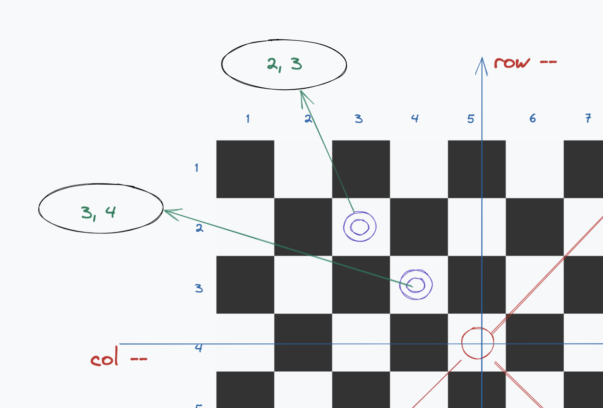

# Solution

Ok so how do we proceed?

As per the rule of the chess board, a bishop can move in any of the 4 diagonal directions.

Let say we have our Bishop at the following position:



### Ok so how do we find the squares being attacked by the bishop?





Look at the index positions of the other pieces on the board.

```
lets say we have a bishop at position (bishop_row, bishop_col) (4, 5)
other pieces are at: (other_row, other_col) (3, 4)

Now let's do some math

diff = bishop_row - other_row
diff = 4 - 3 = 1

```
